# 🖥️ Proyecto de Gestión Administrativa - Mini Market

**Descripción**  
Aplicación de escritorio desarrollada en **Python** con **Tkinter** para la gestión administrativa de un Mini Market. El software permite llevar el control de compras, ventas, inventario, proveedores y análisis financiero con visualizaciones gráficas.

---

## 🧩 Tecnologías Destacadas
- **Lenguaje:** Python  
- **GUI:** Tkinter  
- **Diseño UI:** Figma  
- **Base de datos:** SQLite3  
- **Gráficos y Análisis:** Matplotlib, NumPy

---

## ⚙️ Funcionalidades Principales
- 🧾 Visualización de tablas: **compras**, **ventas**, **productos**, **proveedores**.  
- 📝 **CRUD** completo (Crear, Leer, Actualizar, Eliminar) en las tablas.  
- 📊 Visualización de gráficos:
  - Gráfica de línea: evolución de ventas.
  - Gráfica de barras: comparación compras vs. ventas.
  - Gráfica de dona: Top 8 productos más vendidos.
  - Gráfica de dona: Top proveedores por volumen de compras.
  - Análisis de métricas: **ventas**, **COGS**, **beneficios**, **ganancias**.  
  - Tabla de estado de stock e inventario con alertas (según configuración).  
- 👨🏻‍💻 Gestión y personalización de la cuenta y datos del local.  
- 🔍 Rol de **administrador** con capacidad para supervisar y gestionar otros usuarios.

---

## 📸 Capturas de Pantalla de las Funcionalidades

- **Ventana Reportes / Analizando Metricas** - `ScreenShot/main-menu.png`  
  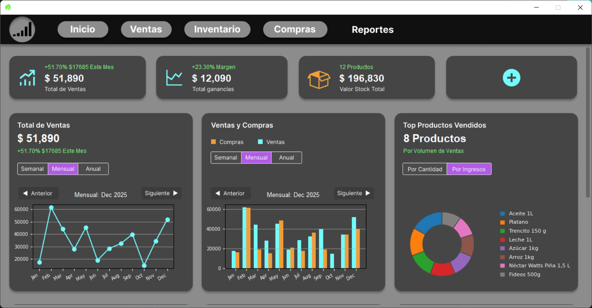
  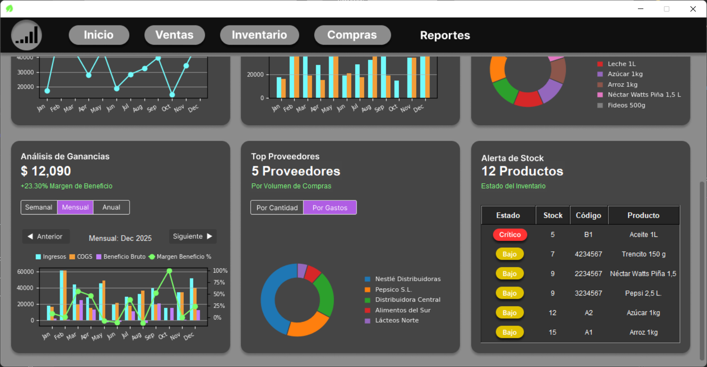

- **Ventana Inventario / Inspeccionando Tablas** - `ScreenShot/chats-page.png`  
  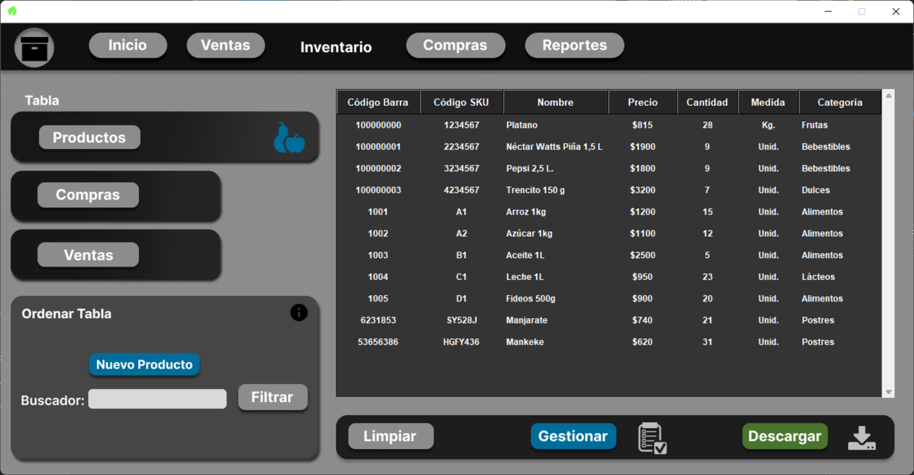
  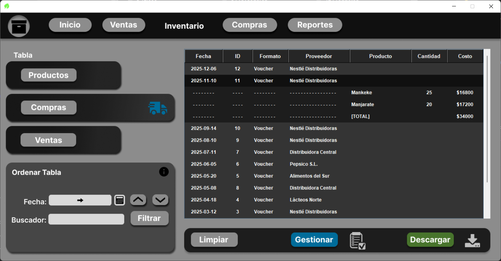
  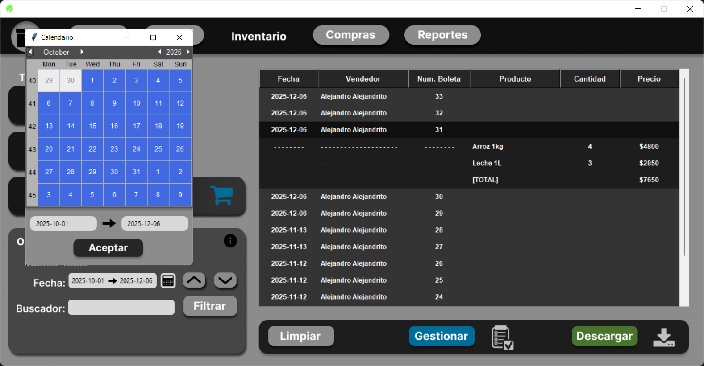

- **Ventana Compras / Registrando Compra** - `ScreenShot/.png`  
  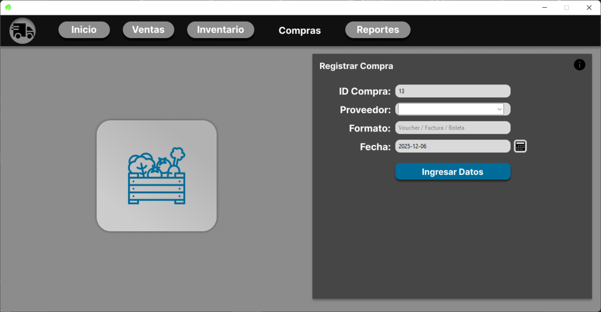
  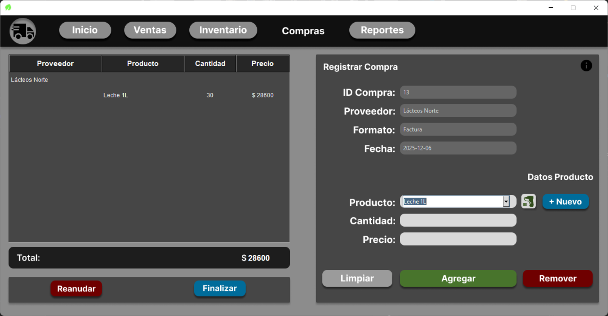

- **Ventana Ventas / Realizando venta** - `ScreenShot/.png`  
  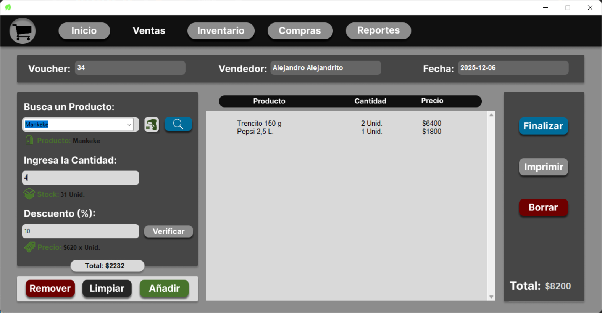

- **Ventana Perfil - Datos Sesión** - `ScreenShot/.png`  
  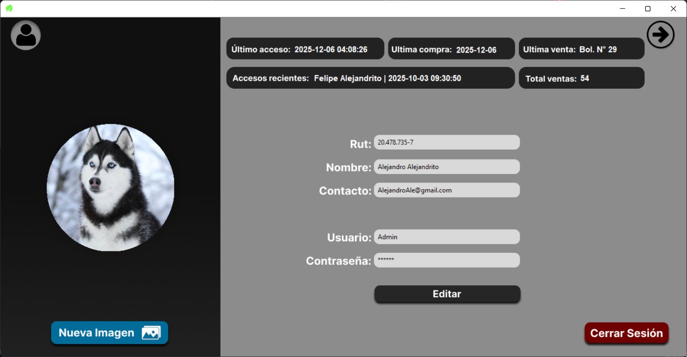

- **Ventana Menú / Página Principal** - `ScreenShot/.png`  
  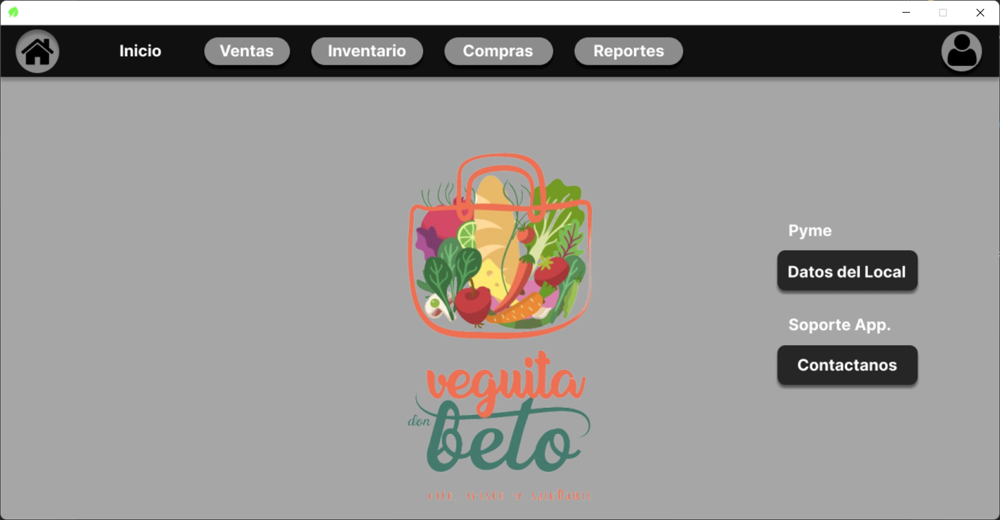
  
- **Crear Nuevo Chat / Selección de Modelo** - `ScreenShot/.png`  
  

- **Ventana Acceso / Registro** - `ScreenShot/.png`  
  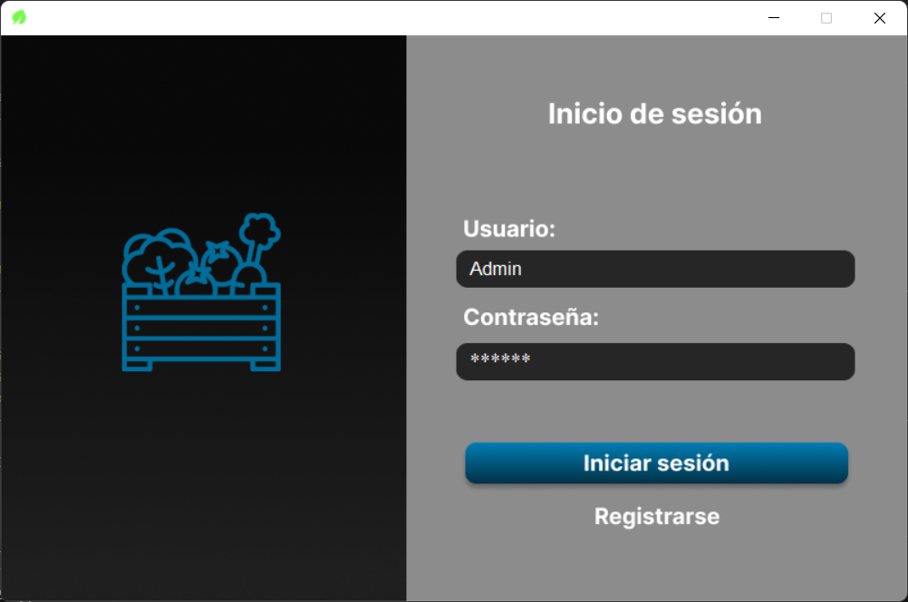
  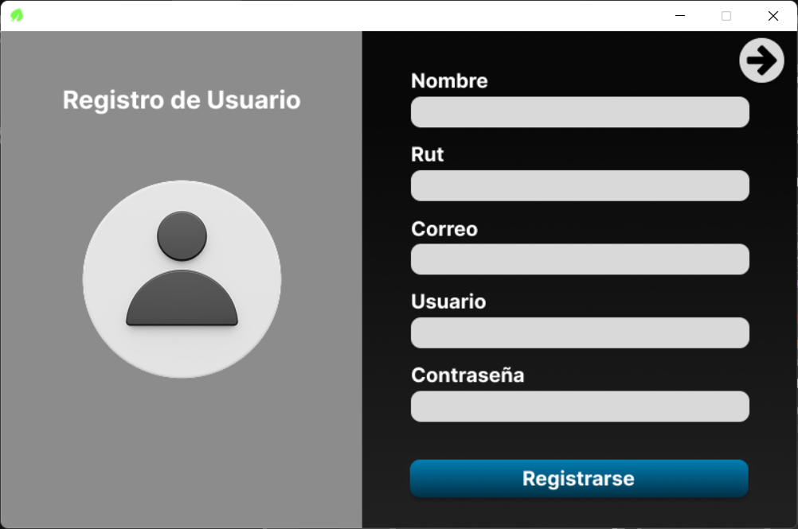

- **Imagenes de las demas Ventanas** - `ScreenShot/chat-dsa.png`  
  📁 Carpeta 'Screenshoots'

---

## 📚 Notas Académicas
Este proyecto fue realizado como parte de la asignatura anual **Ingeniería de Software I y II**, con una contraparte real y bajo la supervisión constante del docente. Se aplicaron metodologías formales: levantamiento de requerimientos, informe técnico, casos de uso y vistas arquitectónicas (4+1).

---

## 📫 Contacto
Si te interesa conocer más sobre el proyecto o colaborar:
- **Email:** [lastra.hernandez.felipe@gmail.com] 
- **LinkedIn:** [https://www.linkedin.com/in/felipe-lastra-96738b261]

---
